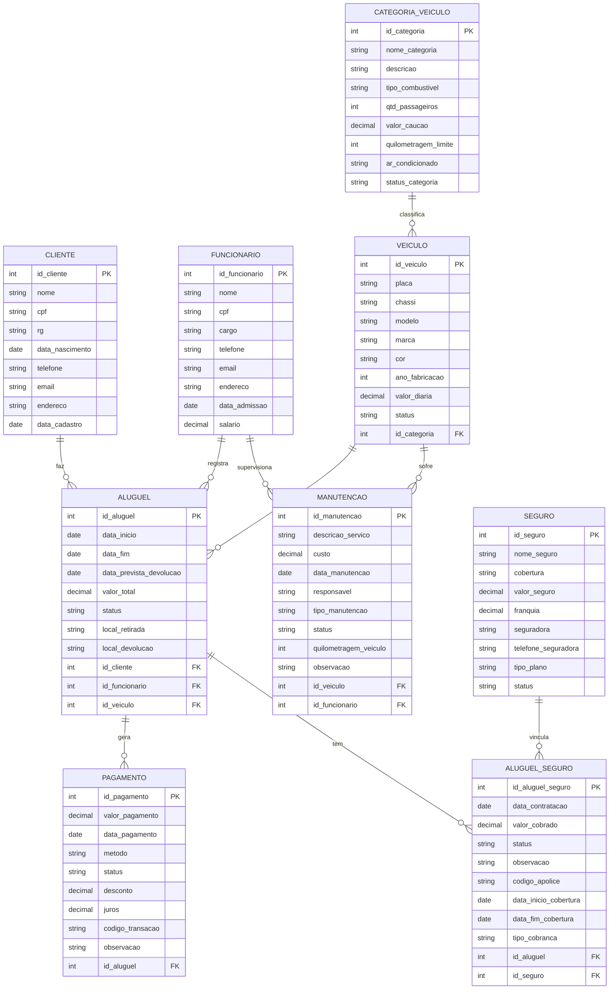

# Diagrama E-R - VelozCar

Este documento apresenta o diagrama entidade-relacionamento do sistema de aluguel de veículos da concessionária **VelozCar**.

## Modelo Entidade-Relacionamento

```mermaid
erDiagram
    CLIENTE ||--o{ ALUGUEL : "faz"
    FUNCIONARIO ||--o{ ALUGUEL : "registra"
    VEICULO ||--o{ ALUGUEL : "participa"
    CATEGORIA_VEICULO ||--o{ VEICULO : "classifica"
    ALUGUEL ||--o{ PAGAMENTO : "gera"
    VEICULO ||--o{ MANUTENCAO : "sofre"
    FUNCIONARIO ||--o{ MANUTENCAO : "supervisiona"
    ALUGUEL ||--o{ ALUGUEL_SEGURO : "tem"
    SEGURO ||--o{ ALUGUEL_SEGURO : "vincula"

    CLIENTE {
        int id_cliente PK
        string nome
        string cpf
        string rg
        date data_nascimento
        string telefone
        string email
        string endereco
        date data_cadastro
    }

    FUNCIONARIO {
        int id_funcionario PK
        string nome
        string cpf
        string cargo
        string telefone
        string email
        string endereco
        date data_admissao
        decimal salario
    }

    CATEGORIA_VEICULO {
        int id_categoria PK
        string nome_categoria
        string descricao
        string tipo_combustivel
        int qtd_passageiros
        decimal valor_caucao
        int quilometragem_limite
        string ar_condicionado
        string status_categoria
    }

    VEICULO {
        int id_veiculo PK
        string placa
        string chassi
        string modelo
        string marca
        string cor
        int ano_fabricacao
        decimal valor_diaria
        string status
        int id_categoria FK
    }

    ALUGUEL {
        int id_aluguel PK
        date data_inicio
        date data_fim
        date data_prevista_devolucao
        decimal valor_total
        string status
        string local_retirada
        string local_devolucao
        int id_cliente FK
        int id_funcionario FK
        int id_veiculo FK
    }

    PAGAMENTO {
        int id_pagamento PK
        decimal valor_pagamento
        date data_pagamento
        string metodo
        string status
        decimal desconto
        decimal juros
        string codigo_transacao
        string observacao
        int id_aluguel FK
    }

    MANUTENCAO {
        int id_manutencao PK
        string descricao_servico
        decimal custo
        date data_manutencao
        string responsavel
        string tipo_manutencao
        string status
        int quilometragem_veiculo
        string observacao
        int id_veiculo FK
        int id_funcionario FK
    }

    SEGURO {
        int id_seguro PK
        string nome_seguro
        string cobertura
        decimal valor_seguro
        decimal franquia
        string seguradora
        string telefone_seguradora
        string tipo_plano
        string status
    }

    ALUGUEL_SEGURO {
        int id_aluguel_seguro PK
        date data_contratacao
        decimal valor_cobrado
        string status
        string observacao
        string codigo_apolice
        date data_inicio_cobertura
        date data_fim_cobertura
        string tipo_cobranca
        int id_aluguel FK
        int id_seguro FK
    }
```
